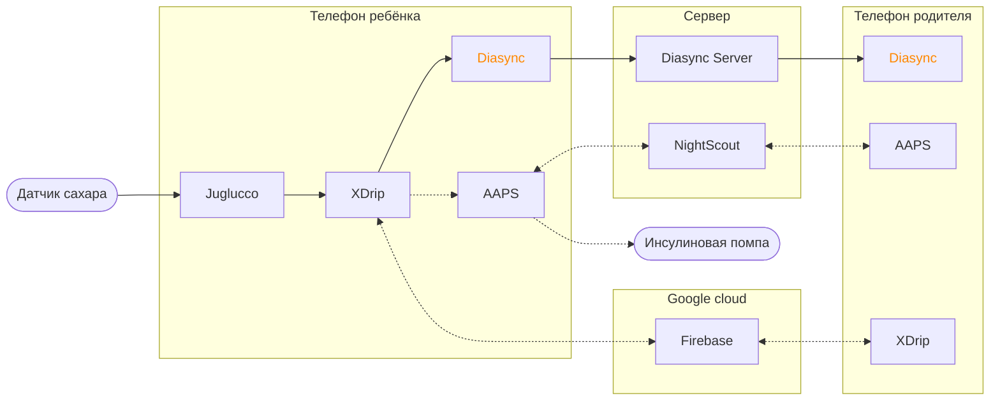

# Diasync android client

Клиентская часть системы мониторинга глюкозы Diasync.

## Пример схемы

Очевидно, схема неполная, на ней не хватает некоторых связей. Например, XDrip и ребенка и родителя
может писать в Nightscout. Но это сильно усложняет восприятие основных потоков данных, поэтому я
оставил их за скобками.

